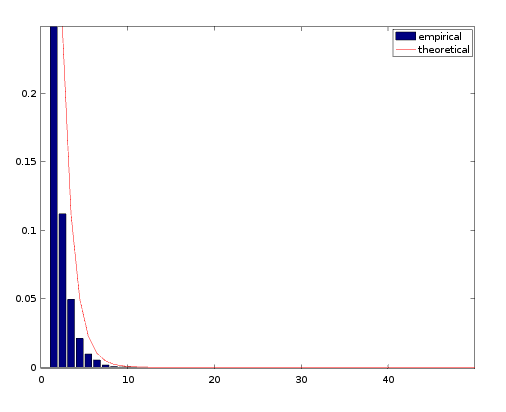

# Randomly Generated Variable with Geometric Distribution.
	

Example of the utilization of the [Inverse Transform Sampling method](https://en.wikipedia.org/wiki/Inverse_transform_sampling) for generating a random variable with a geometric distribution.

Displayed as 'empirical' data is the result obtained from utilising the inverse of the Cumulative Distribution Function for a Geometric Distribution with a collection of pseudo-random numbers.

Displayed as 'theoretical' data is the result obtained using the corresponding Probability Mass Function.